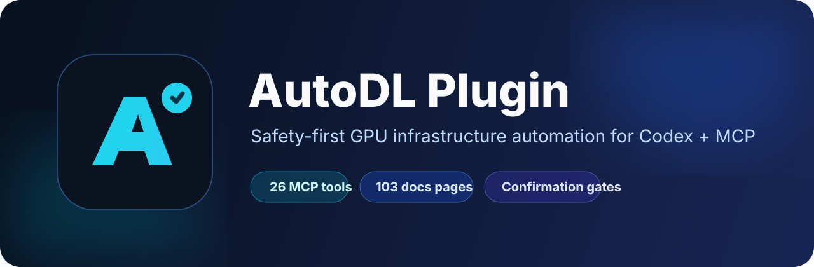
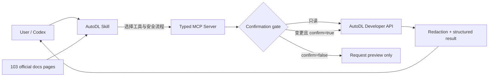

<div align="center">
  
</div>

<div align="center">

[](CHANGELOG.md)
[](#mcp-工具一览)
[](skills/autodl/references/docs-index.md)
[](https://github.com/wuzihuang/AUTODL-PLUGIN/actions)
[](LICENSE)

**让 Codex 安全、可解释地管理 AutoDL GPU 资源。**

Typed MCP tools · Documentation-aware Skill · Confirmation gates · Credential redaction

</div>

---

## 这是什么？

AutoDL Plugin 是一个面向 Codex 的社区插件，把 AutoDL 官方开发者 API 与完整帮助文档封装成两层能力：

1. **AutoDL MCP Server**：26 个参数明确、可校验的工具，负责查询余额、管理容器实例 Pro、操作弹性部署、查询镜像/GPU 库存、读取时长包、发送微信通知和获取容器指标。
2. **AutoDL Skill**：让 Agent 理解 AutoDL 的计费、数据保留、系统盘/数据盘、镜像、网络、SSH、CUDA、训练环境和权限边界，并在高风险操作前执行正确流程。

它不是简单的“HTTP 接口转发器”。插件会区分只读、状态变更、计费和破坏性操作；在真正创建、开机、关机、释放、扩缩容、删除或发送消息前，必须经过确认门。

> [!IMPORTANT]
> 这是社区集成，不是 AutoDL 官方产品。实际服务能力、价格、库存、配额和规则以 [AutoDL 官网](https://www.autodl.com/) 与 [官方文档](https://www.autodl.com/docs/) 为准。

## 亮点

- **26 个 typed MCP 工具**：每个接口都有独立名称、参数说明和输入校验。
- **安全确认门**：变更操作在 `confirm=false` 时只返回请求预览，不访问 AutoDL。
- **凭据保护**：实例详情默认遮盖 `root_password` 与 `jupyter_token`。
- **Token 隔离**：开发者 Token 只从本地环境读取，不进入源码、工具输出或测试夹具。
- **完整文档认知**：索引官方帮助站 103/103 个页面、463 个搜索条目。
- **文档漂移检查**：可重新抓取官方目录并生成页面状态和 SHA-256 清单。
- **真实 MCP 测试**：通过 stdio 握手调用全部工具，而不是只测内部函数。
- **正式环境只读验证**：余额、Pro 实例列表和 Pro 镜像列表已经通过真实 AutoDL API 验证。

## 架构



## 快速开始

### 1. 克隆并安装

```bash
git clone https://github.com/wuzihuang/AUTODL-PLUGIN.git
cd AUTODL-PLUGIN
npm install
```

要求：Node.js 20 或更高版本。

### 2. 配置 AutoDL Token

在 AutoDL 控制台的账号设置中获取开发者 Token，然后创建本地环境文件：

```bash
cp .env.example .env
```

编辑 `.env`：

```dotenv
AUTODL_TOKEN=你的开发者Token
```

`.env` 已被 Git 忽略。不要把真实 Token 写进 README、配置示例、Issue、日志或提交记录。

也可以不创建 `.env`，而是在启动 Codex 的环境中提供：

```bash
export AUTODL_TOKEN='你的开发者Token'
```

### 3. 在 Codex 中加载插件

在支持本地插件的 Codex 中选择这个仓库根目录。Codex 会通过：

- `.codex-plugin/plugin.json` 发现 AutoDL Skill；
- `.mcp.json` 启动本地 AutoDL MCP Server。

如果你的客户端暂时不支持本地插件，可手动配置 MCP：

```json
{
  "mcpServers": {
    "autodl": {
      "command": "bash",
      "args": ["/absolute/path/AUTODL-PLUGIN/scripts/start-mcp.sh"],
      "cwd": "/absolute/path/AUTODL-PLUGIN"
    }
  }
}
```

Skill 也可以单独安装：

```bash
cp -R skills/autodl ~/.codex/skills/autodl
```

### 4. 试着这样问

- “查看我的 AutoDL 余额，金额换算成人民币元。”
- “列出我的 Pro 实例，告诉我哪些还在计费。”
- “查询 `westDC2` 的 RTX 4090 弹性部署库存。”
- “我要创建一个单卡实例，先给我参数和费用风险预览，不要直接创建。”
- “保存这个实例的环境之前，我还需要单独备份哪些数据？”
- “为什么 `nvidia-smi` 的 CUDA 版本和环境里的 CUDA 不一样？”

## MCP 工具一览

### 账户与存储

| 工具 | 作用 | 类型 |
|---|---|---|
| `autodl_wallet_balance` | 获取余额、累计消费与代金券余额 | 只读 |
| `autodl_switch_exclusive_nfs` | 切换专用 NFS / 普通文件存储 | 需确认 |

### 容器实例 Pro

| 工具 | 作用 | 类型 |
|---|---|---|
| `autodl_pro_create_instance` | 创建按量计费 Pro 实例 | 计费、需确认 |
| `autodl_pro_instance_snapshot` | 获取实例硬件、使用率与连接信息 | 只读、默认脱敏 |
| `autodl_pro_instance_status` | 获取实例状态 | 只读 |
| `autodl_pro_list_instances` | 分页列出实例 | 只读 |
| `autodl_pro_power_on` | GPU 模式开机 | 计费、需确认 |
| `autodl_pro_power_off` | 关机 | 需确认 |
| `autodl_pro_release_instance` | 永久释放实例 | **破坏性、需确认** |
| `autodl_pro_save_image` | 保存系统盘为私有镜像 | 需确认 |
| `autodl_pro_list_private_images` | 查询 Pro 私有镜像与保存状态 | 只读 |

### 弹性部署

| 工具 | 作用 | 类型 |
|---|---|---|
| `autodl_esd_list_private_images` | 获取可用于弹性部署的私有镜像 | 只读 |
| `autodl_esd_create_deployment` | 创建 ReplicaSet、Job 或 Container | 计费、需确认 |
| `autodl_esd_list_deployments` | 查询部署 | 只读 |
| `autodl_esd_list_container_events` | 轮询容器生命周期事件 | 只读 |
| `autodl_esd_list_containers` | 查询容器、状态与连接信息 | 只读 |
| `autodl_esd_stop_container` | 停止指定容器 | 需确认 |
| `autodl_esd_set_replica_num` | 调整 ReplicaSet 副本数 | 计费/中断风险、需确认 |
| `autodl_esd_stop_deployment` | 停止整个部署 | 需确认 |
| `autodl_esd_delete_deployment` | 停止并永久删除部署 | **破坏性、需确认** |
| `autodl_esd_set_blacklist` | 将异常容器所在主机加入调度黑名单 | 需确认 |
| `autodl_esd_list_blacklist` | 获取生效中的调度黑名单 | 只读 |
| `autodl_esd_gpu_stock` | 查询地区 GPU 总量和空闲量 | 只读 |
| `autodl_esd_ddp_overview` | 获取已购时长包余额 | 只读 |

### 通知与监控

| 工具 | 作用 | 类型 |
|---|---|---|
| `autodl_send_wechat_message` | 向账号绑定的微信发送通知 | 外部消息、需确认 |
| `autodl_local_metrics` | 获取容器 CPU、内存和 GPU 指标 | 只读、需在容器内可达 |

完整字段、接口路径、地区代码、GPU 规格和基础镜像示例见 [API Reference](skills/autodl/references/api-reference.md)。

## 权限矩阵

| 能力 | 常规 Token | 个人/企业实名认证 | 企业认证与产品权限 |
|---|:---:|:---:|:---:|
| 账户余额 | ✓ | ✓ | ✓ |
| 容器实例 Pro |  | ✓ | ✓ |
| 弹性部署 |  |  | ✓ |
| 弹性部署 GPU 库存 |  |  | ✓ |
| 容器性能监控 |  |  | ✓ |
| 微信通知 | 需绑定微信 | 需绑定微信 | 需绑定微信 |

如果 API 返回“无当前资源访问权限”，插件会解释为认证或产品权限问题，而不是把它误报成 MCP 故障。

## 安全模型

### 确认门

所有会产生费用、改变状态、停止工作负载、删除数据或发送外部消息的工具都有 `confirm` 参数：

```text
confirm=false  → 返回方法、路径、目标与参数预览，不发送网络请求
confirm=true   → 执行真实 AutoDL API 请求
```

Agent 仍应在执行前向用户说明：

- 准确的实例、部署或容器 ID；
- GPU 数、实例数或副本数；
- 价格上限和计费影响；
- 是否中断训练或服务；
- 是否已经备份系统盘和数据盘。

### 数据与凭据

- `root_password`、`jupyter_token` 默认显示为 `[REDACTED]`。
- 本地指标请求不会携带 AutoDL 开发者 Token。
- Token 不会出现在 MCP 结构化结果和错误结果中。
- 释放实例与删除部署被标记为 destructive。
- Pro 实例释放流程要求先关机。

### AutoDL 使用边界

- 严禁将资源用于虚拟货币挖矿。
- 本地系统盘和数据盘没有冗余可靠性承诺，重要数据必须备份。
- 映射服务地址应保持私密，并遵守 AutoDL 自定义服务协议。
- 当前价格、活动、库存、地区、配额和政策日期必须实时核实。

更多规则见 [Operations Guide](skills/autodl/references/operations-guide.md) 和 [Security Policy](SECURITY.md)。

## 关键技术细节

- API Host：`https://api.autodl.com`
- 鉴权：`Authorization: <raw token>`，**不加 `Bearer`**
- 成功判断：`code === "Success"`
- 金额：API 中的相关整数除以 1000 才是人民币元
- CUDA 编码：例如 `118` 表示 CUDA 11.8
- Pro 状态/详情：官方文档定义为 `GET + JSON body`
- GPU 库存：按单卡调度口径，不能证明多卡位于同一台主机
- 专用 NFS：`mountable=1`；切回普通文件存储：`mountable=-1`

## 配置

| 环境变量 | 默认值 | 说明 |
|---|---|---|
| `AUTODL_TOKEN` | 无 | 必填，AutoDL 开发者 Token |
| `AUTODL_BASE_URL` | `https://api.autodl.com` | 开发者 API 根地址 |
| `AUTODL_WEB_BASE_URL` | `https://www.autodl.com` | 微信消息接口根地址 |
| `AUTODL_METRICS_URL` | `http://127.0.0.1:2022/autopanel/v1/api/monitor/current` | 容器本地指标地址 |
| `AUTODL_REQUEST_TIMEOUT_MS` | `20000` | 请求超时，毫秒 |

## 测试

### 全量自动测试

```bash
npm test
```

测试包括：

- Codex plugin manifest 与 MCP 配置校验；
- Skill frontmatter、引用文件和 26/26 工具覆盖；
- 103/103 官方文档页面清单；
- MCP stdio 初始化与工具发现；
- 26/26 工具完整 mock 调用；
- HTTP 方法、路径、query 和 GET JSON body；
- 未确认变更不发网；
- AutoDL 业务错误映射；
- Token 不泄漏；
- 实例凭据默认遮盖；
- 本地指标请求不携带 Token。

### 正式环境只读测试

```bash
npm run test:live
```

这个命令只读取余额、实例、镜像、部署和黑名单等信息，不创建或修改资源。企业接口没有权限时会标为 `SKIP/PERMISSION`。

当前验证记录：

- 账户余额：HTTP 200
- Pro 实例列表：HTTP 200
- Pro 私有镜像列表：HTTP 200
- 弹性部署：测试账号无访问权限，安全跳过
- Pro 状态/详情：测试账号无现存实例，条件跳过

详见 [完整测试报告](docs/TEST_REPORT.md)。

## 官方文档覆盖

文档刷新脚本读取 AutoDL 的 MkDocs 搜索索引，逐页检查正文，并生成：

- [逐页文档索引](skills/autodl/references/docs-index.md)
- [文档审计清单](skills/autodl/references/docs-manifest.json)

当前快照：

| 指标 | 数量 |
|---|---:|
| 搜索索引条目 | 463 |
| 实际页面 | 103 |
| 可访问页面 | 103 |
| 核心 API 操作 | 24 |
| 帮助站补充 API | 2 |

刷新：

```bash
npm run docs:refresh
npm test
```

仓库不会整站复制 AutoDL 文档，只保存路由索引、摘要规则和哈希元数据。涉及价格、认证、库存、配额与政策时应重新查看官方页面。

## 项目结构

```text
AUTODL-PLUGIN/
├── .codex-plugin/plugin.json      # Codex 插件清单
├── .mcp.json                      # MCP 自动发现配置
├── assets/                        # Logo 与 README Banner
├── mcp/
│   ├── src/                       # MCP Server 与 AutoDL HTTP Client
│   └── test/                      # 全工具契约测试、只读实时测试
├── skills/autodl/
│   ├── SKILL.md                   # Agent 工作流与安全规则
│   ├── references/                # API、运维规则、文档索引
│   └── scripts/                   # 文档刷新与 Skill 校验
├── scripts/
│   ├── start-mcp.sh               # 插件 MCP 启动入口
│   └── validate-plugin.mjs        # 插件与敏感信息校验
├── docs/TEST_REPORT.md
└── .github/workflows/ci.yml
```

## 开发与贡献

欢迎补充新公开接口、响应样例、权限说明和文档漂移修复。请先阅读 [CONTRIBUTING.md](CONTRIBUTING.md)。

基本流程：

```bash
npm install
npm test
```

新增状态变更接口时必须：

1. 使用独立 typed tool；
2. 加入 `confirm` 预览门；
3. 描述计费、中断和数据影响；
4. 增加 mock 契约测试；
5. 不使用真实账户执行破坏性 CI 测试。

## License

[MIT](LICENSE)

AutoDL 名称、服务和官方文档归其权利人所有。本项目仅提供社区集成，不代表 AutoDL 官方背书。

---

<div align="center">
  Built for careful automation: inspect first, confirm changes, preserve data.
</div>
